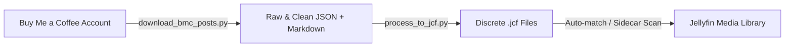

# TheTimestampDudes Buy Me a Coffee Post Downloader & JCF Processor

This guide details the two-stage toolchain for downloading member posts from [TheTimestampDudes Buy Me a Coffee](https://buymeacoffee.com/thetimestampdudes) and processing them into discrete **Jellyfin Content Filter (`.jcf`)** sidecar files.

---

## Overview

[TheTimestampDudes](https://buymeacoffee.com/thetimestampdudes) curate detailed, time-coded timestamps indicating objectionable content (nudity, sexual content, violence, gore, profanity, alcohol/drugs, strobe effects) across hundreds of movies.

This toolchain converts those posts into standard WEBVTT-based JCF sidecars:



1. **[`download_bmc_posts.py`](../download_bmc_posts.py)**: Authenticates with your Buy Me a Coffee account (supporting 2FA / OTP login), retrieves all unlocked creator posts, and saves raw API responses, structured JSON, and individual Markdown files.
2. **[`process_to_jcf.py`](../process_to_jcf.py)**: Parses timestamp intervals, repairs common typing typos, maps category headers to standard Jellyfin filter categories, and exports individual `<Movie Title> (<Year>).jcf` sidecar files.

---

## Prerequisites

Python 3.10+ is required with standard dependencies:

```bash
pip install requests beautifulsoup4 selenium
```

- **Selenium**: Used once during initial login to handle authentication and CAPTCHA.
- **Chrome / Chromium**: Needs to be installed on your system (e.g. `/Applications/Google Chrome.app` on macOS or `google-chrome` on Linux).

---

## Stage 1: Downloading Posts (`download_bmc_posts.py`)

### Authentication & Credential Configuration

Credentials can be supplied in three ways (evaluated in order of precedence):

1. **Secure Interactive Prompt (Recommended)**:
   If no credentials are provided via flags or environment variables, the script prompts you interactively:
   ```bash
   ./download_bmc_posts.py
   ```
   Email is entered normally, and password input is masked using Python's `getpass` (characters are not printed to screen or saved in shell history).

2. **Environment Variables or `.env` File**:
   Set `BMC_EMAIL` and `BMC_PASSWORD` in your shell, or place them in a `.env` file in the project root (which is automatically loaded and ignored by git):
   ```bash
   # .env
   BMC_EMAIL=your.email@example.com
   BMC_PASSWORD=your-secure-password
   ```
   Or export them in your current shell:
   ```bash
   export BMC_EMAIL="your.email@example.com"
   export BMC_PASSWORD="your-secure-password"
   ./download_bmc_posts.py
   ```

3. **Config File (`--config`)**:
   Point to a custom JSON configuration file or environment file:
   ```json
   {
     "email": "your.email@example.com",
     "password": "your-secure-password"
   }
   ```
   ```bash
   ./download_bmc_posts.py --config my_bmc_config.json
   ```

4. **Command-Line Arguments**:
   Pass credentials directly when running in automated environments:
   ```bash
   ./download_bmc_posts.py --email "your.email@example.com" --password "your-secure-password"
   ```

### 2FA Verification (OTP)

If Buy Me a Coffee detects a new device or browser session, it will send a 6-digit one-time code to your registered email address. The script detects this and prompts for the code:
```text
==================================================
[!] Buy Me a Coffee sent a login verification code to your.email@example.com.
>> Please enter the temporary login code: 123456
==================================================
```

### Session Persistence & Security

Once authenticated, session cookies (including secure session identifiers) are saved locally to `bmc_session.json` (or custom path via `--session-file`).

> [!IMPORTANT]
> **No passwords or session tokens are committed to GitHub.**
> `bmc_session.json`, `*.session.json`, `thetimestampdudes_posts/`, and `jcf_thetimestampdudes/` are excluded by `.gitignore`. Never track or push session files or plain-text passwords.

### Subsequent Runs

For subsequent runs, the script automatically loads `bmc_session.json` and connects directly via HTTP without opening a browser or requiring re-authentication:

```bash
./download_bmc_posts.py
```

### Command-Line Options

| Flag | Default | Description |
| :--- | :--- | :--- |
| `--config` | `None` | Path to JSON (`{"email":"...", "password":"..."}`) or `.env` credentials config |
| `--creator` | `thetimestampdudes` | Buy Me a Coffee creator handle |
| `--session-file` | `bmc_session.json` | Path to save/load session cookies |
| `--output-dir` | `thetimestampdudes_posts` | Destination directory for downloaded posts |
| `--login` | `False` | Force re-authentication even if a session file exists |
| `--email` | Env `BMC_EMAIL` | Buy Me a Coffee account email |
| `--password` | Env `BMC_PASSWORD` | Buy Me a Coffee account password |
| `--no-headless` | `False` | Run Chrome with a visible window instead of headless |

### Output Artifacts

The download step produces:
- `thetimestampdudes_posts/posts_raw.json`: Complete raw API payload of all creator posts.
- `thetimestampdudes_posts/posts_clean.json`: Parsed JSON with title, release year, tags, and cleaned plain text descriptions.
- `thetimestampdudes_posts/markdown/*.md`: Clean, human-readable Markdown files for every movie/show post.
- `thetimestampdudes_posts/summary.json`: Summary stats (total count, unlocked ratio, etc.).

---

## Stage 2: Processing into JCF Files (`process_to_jcf.py`)

Run the processor to convert the downloaded data into discrete `.jcf` files:

```bash
./process_to_jcf.py
```

### Key Processing Capabilities

1. **Timestamp Normalization**: Converts all interval variations (`M:SS - M:SS`, `MM:SS - MM:SS`, `H:MM:SS - H:MM:SS`, `MM:SS - H:MM:SS`, `X to Y`, `From X till Y`, etc.) into strict `HH:MM:SS.000` timecodes.
2. **Typo Correction**:
   - **Omitted Hours in End Times**: Corrects entries like `1:14:03 - 15:30` to `01:14:03.000 --> 01:15:30.000`.
   - **Space Typos**: Corrects entries like `1:35 28` or `1:18: 21` into valid timecodes.
   - **Swapped Boundaries**: Detects and fixes accidentally reversed start/end times.
   - **Unit Expressions**: Handles textual expressions like `56 seconds - 1:15` or `0 - 4:30`.
3. **Category Mapping**:
   The creator's headings are mapped to standard Jellyfin Content Filter categories while embedding the original note in the `description:` field:

   | Creator Header Keywords | Mapped JCF Category | Default Action |
   | :--- | :--- | :--- |
   | NUDITY, NUDE, BARE, TOPLESS | `Sex.Nudity` | `skip` |
   | UNDERWEAR, BRA, SUGGESTIVE, KISS, SEX, REVEALING | `Sex.Suggestive` | `skip` |
   | VIOLENCE, FIGHT, SHOT, KILL, CHOKE, ASSAULT | `Violence` | `skip` |
   | GORE, BLOOD, MANGLED, DECAPITATED | `Gore` | `skip` |
   | PROFANITY, LANGUAGE, CURSE, VULGAR, RUDE TALK | `Profanity` | `skip` |
   | ALCOHOL, DRUG, BEER, WINE, SMOKING, CIGARETTE | `Substance` | `skip` |
   | SEIZURE, STROBE, FLASHING LIGHTS | `Warning.Seizure` | `skip` |
   | JUMPSCARE, SCARY, DISTURBING, GROSS | `Suspense` | `skip` |
   | Other / General content | `General` | `skip` |

4. **Multi-Film Splitting**:
   Posts covering multiple movies (e.g. *The Lord of the Rings (all 3 Trilogy movies)*) are automatically identified and partitioned into separate files:
   - `The Lord of the Rings - Fellowship of the Ring (2001).jcf`
   - `The Lord of the Rings - The Two Towers (2002).jcf`
   - `The Lord of the Rings - The Return of the King (2003).jcf`

5. **Cue Merging**:
   Adjacent or overlapping cues with the same category are automatically merged to prevent redundant seek triggers during playback.

### Processor Command-Line Options

| Flag | Default | Description |
| :--- | :--- | :--- |
| `--input` | `thetimestampdudes_posts/posts_clean.json` | Input JSON path |
| `--output-dir` | `jcf_thetimestampdudes` | Output directory for `.jcf` sidecar files |
| `--no-merge` | `False` | Do not merge overlapping/adjacent cues with matching categories |

---

## Output JCF Example

Here is an excerpt from `jcf_thetimestampdudes/Alien (1979).jcf`:

```vtt
WEBVTT JCF

NOTE
TITLE Alien
YEAR 1979
SOURCE TheTimestampDudes (buymeacoffee.com/thetimestampdudes)

00:05:08.000 --> 00:06:46.000
category: Sex.Suggestive
description: [UNDERWEAR] Men and Women in sleep chambers in their underwear.
channel: video
action: skip

00:33:20.000 --> 00:34:33.000
category: Gore
description: [GORE] An alien pops out at a man's head as he examines a skeleton.
channel: video
action: skip

00:52:22.000 --> 00:56:58.000
category: Gore
description: [GORE, MAY BE DISTURBING] A Man starts choking then writhes around, a baby Alien pops out of his chest, very bloody and may be disturbing.
channel: video
action: skip
```

---

## Using JCF Files in Jellyfin

### Method 1: Library Sidecar Placement (Automatic)
Copy the `.jcf` file directly into your movie directory next to the video file, matching the video file's base name:

```text
/movies/
└── Alien (1979)/
    ├── Alien (1979).mkv
    └── Alien (1979).jcf
```

Then in Jellyfin, navigate to **Dashboard → Content Filter → Scan Library for Sidecars**. Jellyfin will automatically detect and associate the cues.

### Method 2: Drag & Drop via Web Admin
In Jellyfin, open **Dashboard → Content Filter**:
1. Select the movie from the browser tree on the left.
2. Drag and drop the corresponding `.jcf` file onto the dropzone.
3. The cues will appear instantly in the editor table.

---

## Running Automated Tests

Run the complete test suite to verify the downloader and processor:

```bash
pytest tests/test_download_bmc_posts.py tests/test_process_to_jcf.py
```
